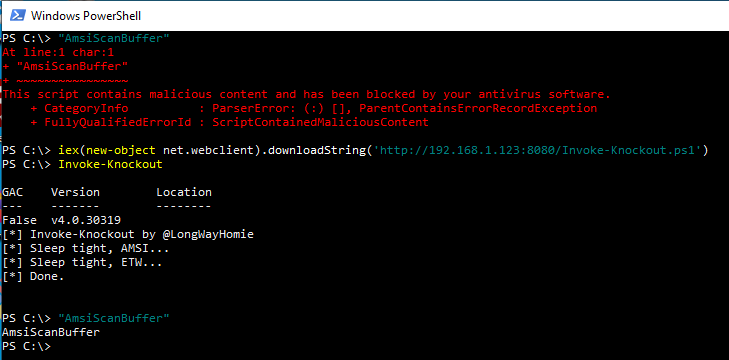

# Invoke-Knockout
Just another DLL library built to knockout (bypass) AMSI (Antimalware Scan Interface) and ETW (Event Tracing for Windows) at the same time (so they don't bother you while you do evil things). Based on RastaMouse [AmsiBypass](https://github.com/rasta-mouse/AmsiScanBufferBypass) and Brendan's Ortiz [article](https://blog.securityevaluators.com/creating-av-resistant-malware-part-1-7604b83ea0c0) on how to bypass AV and EDR. 
I have added Powershell script you can use to load the DLL directly to the memory.
 
 

 
